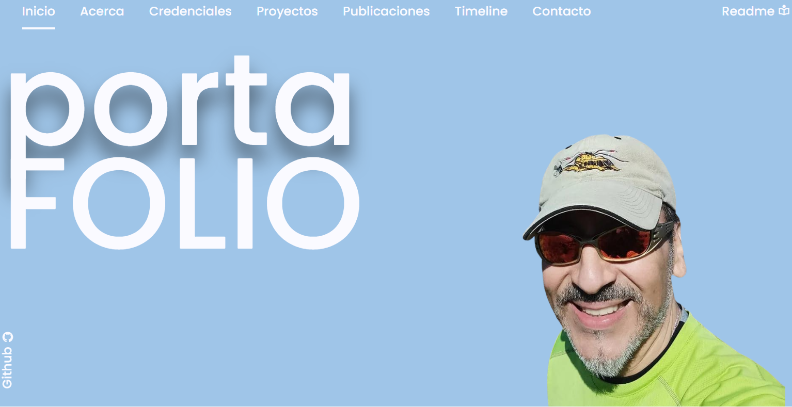

# Portafolio Personal: Demostrando Habilidades Full Stack

## Introducción

Este proyecto nace como resultado de la evaluación al término del módulo 2 del curso "Full Stack Python", con el objetivo de mostrar las habilidades técnicas aprendidas creando una página web funcional y estéticamente agradable que, a su vez,  sirva como vitrina para mostrar, brevemente, quien es el autor y sus proyectos.

La página web es **responsiva**, adaptándose a diferentes dispositivos, y cuenta con las siguientes secciones:

* **Información personal:** Un breve resumen sobre la persona y sus intereses.
* **Habilidades:** Un carrusel que muestra certificaciones en forma interactivas, accediendo ademas al link de verificacion.
* **Proyectos:** Una galería con proyectos destacados.
* **Artículos:** Presenta una introduccion a distintos articulos escritos por el autor sobre tecnologia y un link para leerlos en forma completa.
* **Experiencia:** Se presenta como un concepto grafico en una linea de tiempo, que permite acceder a informacion expansiva sobre experiencias especificas de la trayectoria profesional.
* **Formulario de contacto:** Se incluye un formulario de contacto con validación de campos usando scripts de javascript. Tambien se agrego un selector de objetivo, pudiendo la persona indicar si es por informacion, solicitar un presupuesto o, reclamar por alguna situacion.

## Estructura del repositorio


## Tecnologías Utilizadas

[Imagen de un conjunto de iconos representando las tecnologías utilizadas, por ejemplo: https://www.freeicons.io/iconsets/3026]

* `<i class="bi bi-bootstrap"></i>` **Bootstrap 5:** Framework CSS para crear diseños responsivos y modernos.
* **JavaScript:** Lenguaje de programación para agregar interactividad.
* **CSS:** Para estilizar la página y crear la apariencia deseada.
* **jQuery:** Biblioteca JavaScript para simplificar la manipulación del DOM.
* **HTML:** Lenguaje de marcado para estructurar el contenido de la página.
* **Visual Studio Code:** Entorno de desarrollo integrado para escribir y depurar el código.

## Cómo contribuir

Si deseas contribuir a este proyecto, sigue estos pasos:

1. **Visita el sitio:**
   (https://jcordovaj.github.io)
2. **Revisa la documentación y descripción del Proyecto:**
   (https://github.com/jcordovaj/jcordovaj.github.io.git/docs/)
3. **Revisa la lista de cosas por hacer (T2D):**
   (https://github.com/jcordovaj/jcordovaj.github.io.git/t2d.md)
4. **Clona el repositorio:**

   ```bash
   git clone https://github.com/jcordovaj/jcordovaj.github.io.git

   ```
5. **Sube tu request:**

   * **Documenta tus aportes:** Utiliza nomenclatura y convenciones de nombres de acuerdo a PEP8. Al finalizar, genera una nota de versionado en formato md, que indique la sección que fue afectada, las clases modificadas y js que esté involucrado.
   * **Estilo y Diseño:** Mantén la paleta de colores y un estilo minimalista.
   * **Prohibiciones:** No incorporar contenido ajeno al objetivo del sitio, ideológico, ilegal, publicitario o mal intencionado.
   * **Imagenes u otro contenido audiovisual:** Deben estar libres de derechos (copyright).
6. **Finalmente, si te gusto, dame una estrella:**

`<a href="https://github.com/jcordovaj/jcordovaj.github.io/star"><i class="fa fa-star">``</i>` Yo te apoyo!!!`</a>`


