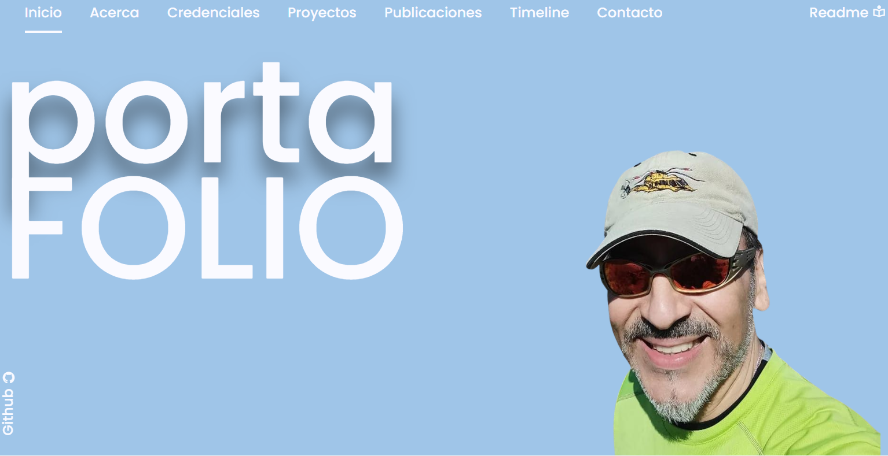
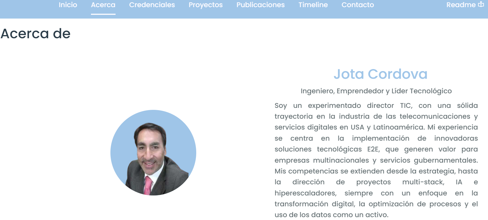

# Portafolio Personal: Demostrando Habilidades Full Stack



## Introducción

Este proyecto nace como resultado de la evaluación al término del módulo 2 del curso "Full Stack Python", con el objetivo de mostrar las habilidades técnicas aprendidas creando una página web funcional y estéticamente agradable que, a su vez,  sirva como vitrina para mostrar, brevemente, quien es el autor y sus proyectos.

La página web es **responsiva**, adaptándose a diferentes dispositivos, y cuenta con las siguientes secciones:

* **Home:** la solución consiste de una sobria pero llamativa sección de "Inicio" o "Home", que posee una interfaz intuitiva, que organiza la información de navegación mostrando las demás secciones del sitio en la parte superior. Adicionalmente, al cambiar de tamaño para pantallas más pequeñas (responsiveness), el menu se colapsa, ofreciendo una alternativa de interfaz con un menú lateral. Se han agregado tooltips, a algunas etiquetas o textos para facilitar su comprensión, por ejemplo, sobre el ícono del menú lateral en pantallas pequeñas.

  * Imagen Home pantallas grandes:
  <p float="left">
      
  </p>
  
  * Imagen Home pantallas pequeñas:
    <p float="left">
      
    </p>  
    
* **Información personal (Acerca):** Se presenta un breve resumen sobre mi persona e intereses generales.

  * Imagen sección Acerca
    
* **Credenciales:** Esta sección presenta un carrusel de tarjetas (clase card de bootstrap), el visitante podrá desplazarse en la cinta, de izquierda a derecha o viceversa, utilizando botones de navegación. Cada tarjeta presenta información breve sobre la certificación o habilidad adquirida y un botón que dice "Verificar", que abre el link en la página ofcial para la comprobación.

  * Imagen sección Credenciales
    
* **Proyectos:** La siguiente sección es una selección de proyectos (PORTAFOLIO) que representan un conjunto de habilidades a mostrar a los visitantes. La galería se redujo a proyectos destacados. La galería con miniaturas de los proyectos tiene unos efectos de "blur" u "opacamiento", que se activan al pasar el mouse por encima y conecta a los links del contenido en Github, o en los sitios donde se encuentran alojados. Los links sin contenido o cortados apuntan a una página de error 404.

  * Imagen sección Proyectos 01
    
  * Imagen sección Proyectos 02 - Galería
    
* **Publicaciones:** También se ha incluído una sección con publicaciones, donde se introducen distintos articulos y opiniones escritas por mi, sobre tecnologia y actualidad, ofreciendo al visitante "continuar leyéndolos", y se han agregado los links para leerlos en forma completa desde la fuente.

  * Imagen sección Publicaciones
    
* **Timeline:** Para concluir y escapando de la forma tradicional de presentar una hoja de vida, se concibió estructurar una "LINEA DE TIEMPO" y hacerlo más atractivo. Entonces, se presenta la información a través de un concepto gráfico con datos mínimos y, si el visitante desea explorar más, tiene la opción de cliquear el link de "Leer más...", y se abre un **MODAL** con un detalle más amplio. Para lograr esto, se buscó y adaptó una librería que mostraba noticias. Se ha dejado como ejemplo completo, sólo la primera entrada a la línea de tiempo, el resto de elementos, presentan "Lorem ipsum" en donde corresponde, dejando su llenado para otra versión.

  * Imagen sección Timeline
    
  * Imagen del Modal-Detalle de la Experiencia
    
* **Formulario de contacto:** Se incluye un formulario de contacto con validación de campos usando scripts de javascript. Tambien se agregó un selector de objetivo del mail (despliega 3 opciones), pudiendo la persona definir si su correo es con propósitos informativos, para solicitar un presupuesto o, para reclamar por alguna situacion. Se integró el formulario con un servidor virtual de correo, y quedó 100% funcional, por lo que se, si el visitante deja un mensaje, este será recibido en la casilla de correo indicada en la web, que es parametrizable. La casilla está oculta con una key de correo. Se han agregado otros detalles como indicaciones para llegar con "Google Maps" y un mapa referencial de la oficina o domicilio.

  * Imagen sección Contacto
    
  * Prueba de funcionamiento del correo
    
* **Manejo de errores:** Para manejar los links cortados, en aquellos casos que se han dejado intencionalmente en blanco, se ha implementado que muestre una página de error (error404.html), la página ofrece además, un botón "VOLVER", que devuelve al visitante al home o index de la página.

  * Imagen para Links Cortados o Contenido en Preparación
    

## Estructura del repositorio

Para una mejor comprensión de la ubicación de los archivos y su lógica, se adjunta la siguiente estructura:

PD.: Puede haber pequeños cambios al momento de esta versión.


## Tecnologías Utilizadas

En la realización de este proyecto se han utilizado, principalmente, las siguiente herramientas y tecnologías

* **Bootstrap 5:** Framework CSS para crear diseños responsivos y modernos.
* **JavaScript:** Lenguaje de programación para agregar interactividad.
* **CSS:** Para estilizar la página y crear la apariencia deseada.
* **jQuery:** Biblioteca JavaScript para simplificar la manipulación del DOM.
* **HTML:** Lenguaje de marcado para estructurar el contenido de la página.
* **Visual Studio Code:** Entorno de desarrollo integrado para escribir y depurar el código.
* **Notepad++:** Edición de documentos con formatos específicos, principalmente CSS, MD y JS.
* **Otras tecnologías gráficas:** Se han utilizado otras hmtas. para editar imagenes y crear objetos gráficos.

## Cómo contribuir

Si deseas contribuir a este proyecto, sigue estos pasos:

1. **Visita el sitio:**
   [Portafolio de Jota Cordova](https://jcordovaj.github.io), si te gusta...
2. **Mira la [demo del proyecto en &#34;Youtube&#34;...](https://youtu.be/RjkiNr5Jew4)**
3. **Revisa la lista de cosas por hacer - Things to do (T2D):**
   [Ir al documento T2D](https://jcordovaj.github.io/assets/docs/t2d.html), si crees que tienes algo que aportar...
4. **Revisa la [Guía de Estilo y Buenas Practicas del Proyecto](https://jcordovaj.github.io/assets/docs/buenasPracticas.html):** luego, si quieres mantenerte informado...
5. **Solicita ser agregado como colaborador a TRELLO:** [Ir al tablero del Proyecto](https://trello.com/b/thnQjQ3S/things-2-do) ahora sí, manos a la obra ....
6. **Clona el repositorio:**

   ```bash
   git clone https://github.com/jcordovaj/jcordovaj.github.io.git
   ```
7. **Sube tu request:**

   * **Documenta tus aportes:** Utiliza nomenclatura y convenciones de nombres de acuerdo a la Guía de Estilo y Buenas Prácticas. Al finalizar, genera una nota de versionado en formato md, que indique la sección que fue afectada, las clases modificadas y js que esté involucrado.
   * **Estilo y Diseño:** Mantén la paleta de colores y un estilo minimalista.
   * **Prohibiciones:** No incorporar contenido ajeno al objetivo del sitio, tampoco ideológico, ilegal, publicitario o mal intencionado.
   * **Imagenes u otro contenido audiovisual:** Deben estar libres de derechos (copyright).
8. **Finalmente, si te gusto el proyecto y has decidido participar, [dame una estrella](https://github.com/jcordovaj/jcordovaj.github.io/):**
   


