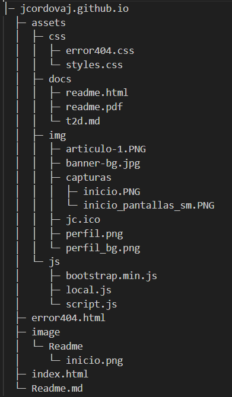

# Guía de Estilo y Buenas Prácticas para Colaboradores

## Estructura y Organización

### Semántica HTML

* Utilizar etiquetas HTML con su significado semántico correcto (p.ej., `<h1>` para encabezados, `<nav>` para navegación, `<section>` para secciones).
* Evitar usar divs genéricos a menos que sea estrictamente necesario o que deba ser dejado pendiente de renombrar, mientras se verifica, registrándolo en el backlog para evitar duplicidades.
* Crear lógica de nombres por sección y documentar en cada sección los nombres importados, por ejemplo, cuando se utilicen librerías externas (SECCION Skills: skills__container, skills__subtitle).

### Estructura de archivos

* Usar las carpetas respectivas para almacenar nuevos archivos. En este proyecto, hay una carpeta "assets" que contiene carpetas para CSS, JS, IMG y DOCS. En la raíz, sólo se mantienen el "index", "README" y "error404".
* Los archivos deben seguir la lógica de sus carpetas, por ejemplo, los de extensión "css", van a la carpeta CSS, y los "js", a la carpeta JS.

### Convenciones de nombrado

* Utiliza nombres de clases y ID descriptivos y consistentes con la SECCIÓN a la que pertenecen.
* Sigue una convención de nombrado, por ejemplo, BEM (Block, Element, Modifier), SMACSS (Scalable and Modular Architecture for CSS).

  Ejemplo BEM:

  ```CSS
  .button { /*Bloque */
  /* Estilos básicos del botón*/
  }
  .button__text { /*Elemento dentro del bloque */
  /* Estilos del texto del botón*/
  }
  .button--primary { /*Modificador del bloque*/
  /*Estilos para un botón primario*/
  }
  ```

  Ejemplo SMACSS:

  ```CSS
  /*Base*/
  body {
  font-family: sans-serif;
  }
  /* Layout */
  .container {
  max-width: 1200px;
  margin: 0 auto;
  }
  /* Módulo*/
  .button {
  /*Estilos del botón*/
  }
  /*Estado*/
  .button:hover {
  /*Estilos al pasar el ratón por encima*/
  }

  /*Tema*/
  .primary {
  color: blue;
  }
  ```

### Indentación y espaciado:

* Indentación consistente (4 espacios) para mejorar la legibilidad.
* Agrega espacios en blanco alrededor de los operadores y dentro de las propiedades CSS.

  * **Ejemplo CSS sin espacios:**
```CSS
    .button{padding:10px;background-color:#007bff;border:none;color:#fff;}
```
  * **Ejemplo CSS con espacios:**

```
	.button {
 	 padding: 10px;
  	background-color: #007bff;
  	border: none;
	  color: #fff;
	}
```

## HTML

### Validez:

* Validar el HTML y hacer pruebas básicas de funcionalidad para asegurar que no hay errores de sintaxis.

### Accesibilidad:

* Utilizar atributos alt descriptivos en las imágenes.
* Proporcionar etiquetas "title" para los enlaces.
* Utilizar encabezados semánticos (h1, h2, etc.), acompañados por la clase de la sección, (ejemplo, h1 class="skills__subtitle").
* Procurar que el contenido sea accesible para usuarios con discapacidades.

### Rendimiento:

* Minimizar el número de elementos HTML.
* Evitar anidar elementos innecesaria o excesivamente.

### Mantenimiento:

* Comentar el código por sección, por div, o por id, de ser necesario, sobretodo para explicar secciones complejas.

## CSS

### Especificidad:

* Utiliza clases y ID de forma eficiente para evitar conflictos de estilos.
* Evitar el uso excesivo del selector universal (*).

### Modularidad:

* Divide tus estilos en archivos CSS separados para una mejor organización.
* En el archivo de estilos personalizados, organiza  la página en forma top-down, primero con las clases globales o "root:", luego, agrupa las clases por sección, partiendo por las más generales (e.g: Containers, DIVs, etiqueta), para minimizar los problemas con el efecto cascada.
* Utiliza preprocesadores CSS (Sass, Less) para mejorar la modularidad y la reutilización de código.

### Rendimiento:

* Minimiza el número de archivos CSS.
* Combina y comprime los archivos CSS.
* Utiliza propiedades CSS3 eficientes.

### Mantenimiento:

* Organiza tus reglas CSS de forma lógica (por ejemplo, por tipo de selector, por componente).
* Utiliza comentarios para explicar las reglas CSS complejas.

## JavaScript

### Modularidad:

* Dividir el código en módulos o funciones reutilizables.

### Pruebas:

* Agrega  pruebas unitarias para garantizar la calidad de tu código.

### Rendimiento:

* Minimizar el número de consultas al DOM para no degradar el rendimiento de la página.
* Evitar bucles innecesarios.
* Utiliza técnicas de optimización de JavaScript.

### Mantenimiento:

* Comenta tu código JavaScript para explicarlo.
* Utiliza nombres de variables y funciones descriptivos.
* Otras Consideraciones

### Control de versiones:

* Al hacer un commit, agrega información descriptiva y lo suficientemente completa para poder gestionar los cambios en el código y facilitar la revisión del pull request.

### Linter:

* Utiliza un linter para identificar errores y mejorar la calidad del código.

### Framework:

* Para estructuras complejas, considera el uso de un framework CSS (Bootstrap, Materialize). En siguientes versiones, se considera usas un framework JavaScript (React, Angular) para acelerar el desarrollo y mejorar la mantenibilidad.

## Ejemplo de Estructura de Carpetas


