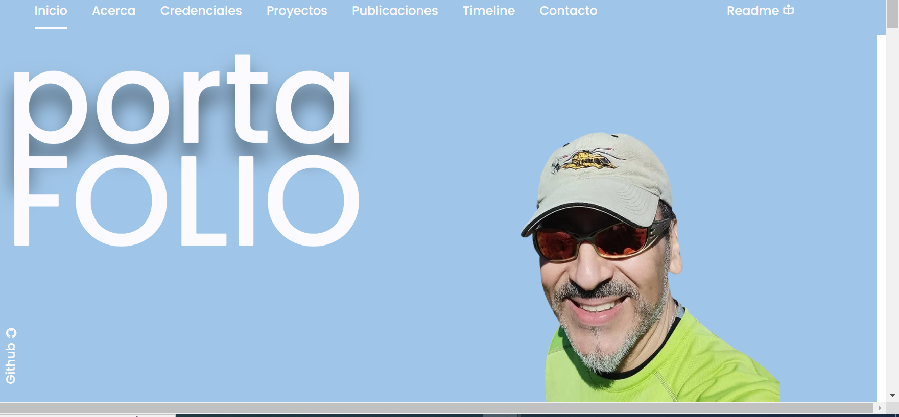
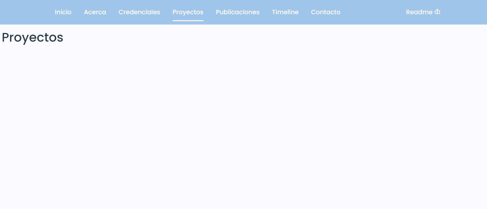

# Backlog del Proyecto Portafolio Personal

## Tareas Pendientes

* **Pendiente 1:**
  * *Descripción detallada de la característica:* Revisar las clases y darles uniformidad para evitar que se pisen clases.
  * *Categoría*: Área de mejora
  * *Prioridad (alta, media, baja)*: La página está en un estado funcional, por lo que la prioridad es BAJA.
  * *Etiquetas (ej: backend, frontend, UX)*: CSS, estilos
* **Pendiente 2:**
  * *Descripción detallada de la característica:* Probar y revisar los @MediaQuerys en distintos aparatos y corregir las restricciones, no siempre se están dando los ajustes fijados al inicio, a veces hay conflicto con librería scroll reveal.
  * *Categoría:* Área de mejora
  * *Prioridad (alta, media, baja):* La página está en un estado funcional, sin embargo, bajo condiciones de borde los ajustes de tamaño a pantallas pequeñas, no responden bien. La prioridad es BAJA.
  * *Etiquetas (ej: backend, frontend, UX):* CSS, estilos
* **Pendiente 3:**
  * *Descripción detallada de la característica:*  Revisar formulario de correo. Se conectó servicio de correo externo, pero no se ha verificado que funcione correctamente
  * *Categoría:* Área de mejora
  * *Prioridad (alta, media, baja):* La página está en un estado funcional, y cumple con los requisitos establecidos para esta evaluación pero, es un deseable que el formulario permita recibir las interacciones con visitantes. La prioridad es BAJA.
  * *Etiquetas (ej: backend, frontend, UX):* Backend, correo
* **Pendiente 4:**
  * *Descripción detallada de la característica:*  Conectar elemento "Leer más" de las "news", de la sección "Timeline", con un modal. En las pruebas, la página se congela  y bloquea, impidiendo cerrarlo.
  * *Categoría:* Área de funcionalidad
  * *Prioridad (alta, media, baja):*  Si bien la página está en un estado funcional, y cumple con los requisitos establecidos para esta evaluación. es una funcionalidad necesaria para que el diseño conceptual de la página tenga sentido, es decir, que se conecte un cotenido expansivo a un link. Prioridad es ALTA.
  * *Etiquetas (ej: backend, frontend, UX):* Frontend, funcionalidad

## Errores Conocidos

* **Bug 1:**

  * Descripción detallada del error: Bajo ciertas combinaciones, seha observado que al volver a renderizarse la página de inicio, se produce una franja vertical blanca al costado derecho (bajo la franja del NAV, debajo del link al readme), podría ser por diferencias de ajuste al cambiar de tamaños de la clase NAV y el HEAD,  y/o por efectos de la librería que muestra progresivamente los contenidos. Cuando la página debe recalcular muchas veces la distribución de los objetos contenidos, a veces queda en espera y no renderiza.
  * Pasos para reproducirlo: Navegar por la página, abrir las herramientas de programdor, retornar al inicio, cambiar los tamaños. No se ha encontrado la combinación exacta para reproducir el evento.
  * Walkaround: Refrescar la página. Normalmente, se vuelve a renderizar bien, después de la primera vez.
  * Capturas de pantalla:
  * 
* **Bug 2:**

  * Descripción detallada del error: Secciones que quedan en blanco o no renderizan bien sus contenidos. En la documentación de la librería "scroll reveal" de javascript, indica que cuando que cambian rápidamente los tamaños de pantalla en modo responsivo y, además, el javascript del efecto está activo, puede ocurrir que no se renderize la página.
  * Pasos para reproducirlo: Cambiar el tamaño repetida y rápidamente .
  * Walkaround: Refrescar la página. Normalmente, se vuelve a renderizar bien, después de la primera vez que se refresca.
  * Capturas de pantalla:

  

## Mejoras Futuras

**Mejora A:**

* Descripción de la mejora:  Generar BBDD con datos de quienes completen el formulario. Se espera poder conectar los datos del formulario a un motor de BBDD
* Beneficios esperados: Administrar los contactos, guardar copia de los mensajes.

**Mejora B:**

* Descripción de la mejora:  Enviar confirmación del correo al visitante. Cualquier interacción requiere una respuesta visual para el usuario.
* Beneficios esperados: Mejorar la experiencia del usuario.

**Mejora C:**

* Descripción de la mejora:  Implementar previsualización del correo y proveer texto enriquecido para que soporte estilos wysiwyg, imagenes (fotos), etc.
* Beneficios esperados: Mejorar la flexibilidad y personalización de los mensajes.

**Mejora D:**

* Descripción de la mejora:  Integrar contenido dinámico con conexión a RSS, actualización de cambios en proyectos en Github, etc.
* Beneficios esperados: Generar contenidos que puedan ser de interés para los visitantes y aseguren más vistas orgánicas.

## Documentación

* **Guía de estilo:** Para contribuciones, se agradece consultar la guía de estilo y buenas prácticas del proyecto. [ir a &#34;Guía de Estilo&#34;](buenasPracticas.pdf)
* **Arquitectura del sistema:** Como referencia, se incluye un diagrama o descripción de la arquitectura. (./assets/docs/architecture.png, pendiente\*)

## Otros

**Notas:**

* Usa los canales para hacer llegar consultas, reclamos y sugerencias.
* Concede los derechos de autor a quien corresponda.
* No incluyas contenidos ideológicos, reñidos con las buenas costumbres o leyes aplicables.

**Considerar:**

* Solicitar acceso al sistema de seguimiento de tareas del proyecto en Trello, para gestionar y coordinar el backlog en forma más visual, colaborativa y efectiva.
